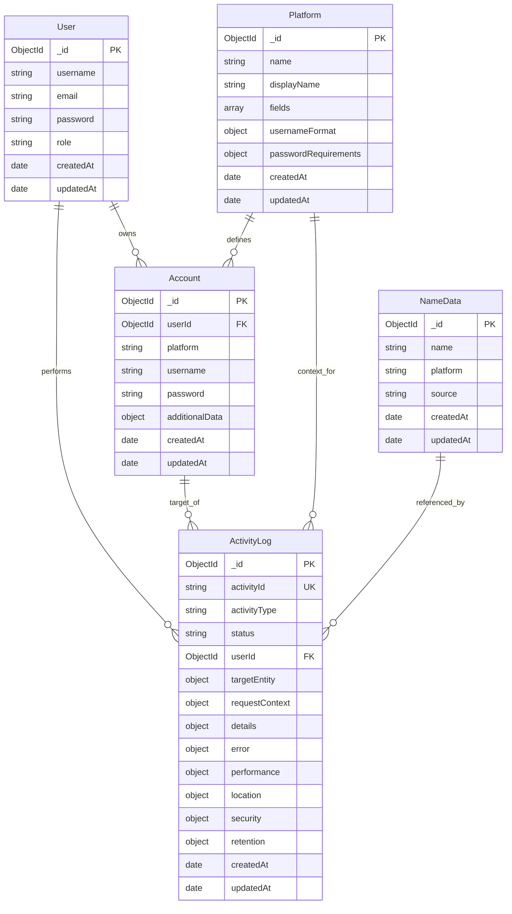
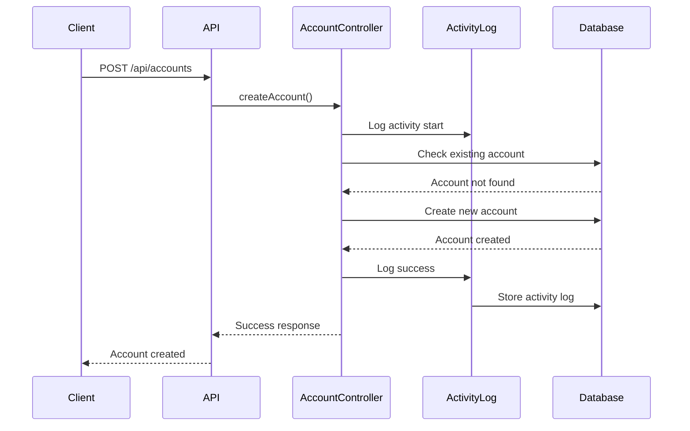
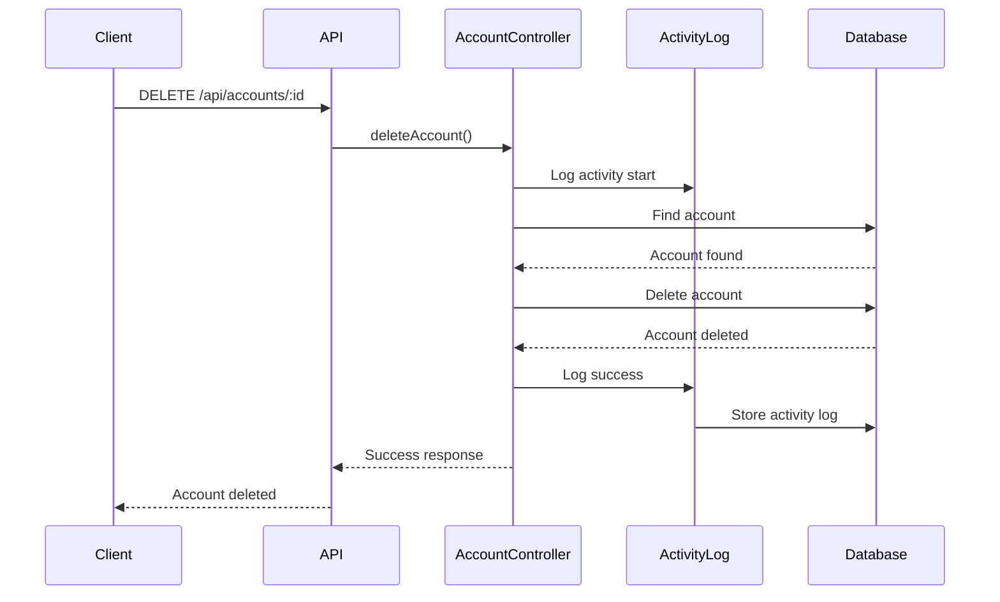
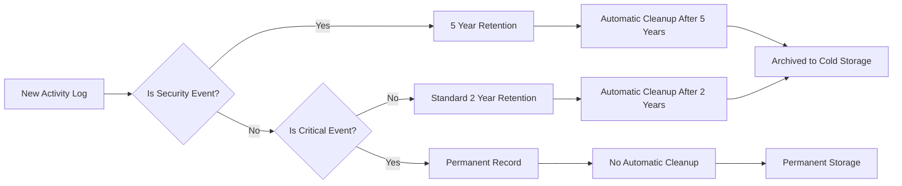
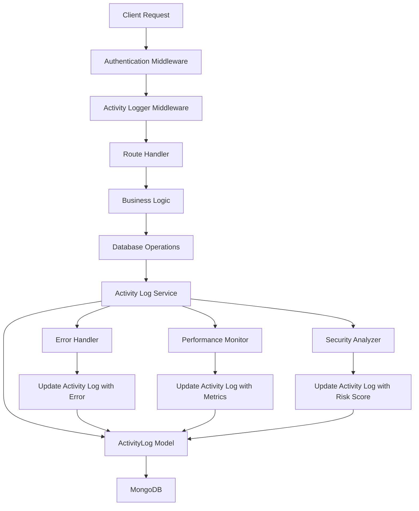

# ActivityLog Model Relationship Diagram

## Entity Relationship Diagram



## ActivityLog Field Details

### Core Identification
- **activityId**: Unique identifier for each activity (format: ACT_timestamp_randomString)
- **activityType**: Type of activity (ACCOUNT_CREATE, ACCOUNT_DELETE, etc.)
- **status**: Status of the activity (SUCCESS, FAILURE, PENDING, TIMEOUT)

### User Context
- **userId**: Reference to the User who performed the action

### Target Entity Information
- **targetEntity**: Object containing:
  - **entityType**: Type of entity (Account, User, Platform, etc.)
  - **entityId**: ID of the target entity (if available)
  - **entityName**: Human-readable name of the entity
  - **platform**: Platform name (for account operations)

### Request Context
- **requestContext**: Object containing:
  - **ipAddress**: Client IP address
  - **userAgent**: Browser/client user agent
  - **requestId**: Unique request identifier
  - **sessionId**: Session identifier
  - **endpoint**: API endpoint
  - **method**: HTTP method
  - **timestamp**: Request timestamp

### Activity Details
- **details**: Object containing:
  - **beforeState**: State before the activity
  - **afterState**: State after the activity
  - **changes**: Array of field changes
  - **metadata**: Additional metadata

### Error Information
- **error**: Object containing:
  - **code**: Error code
  - **message**: Error message
  - **stack**: Error stack trace
  - **details**: Additional error details

### Performance Metrics
- **performance**: Object containing:
  - **duration**: Operation duration in milliseconds
  - **memoryUsage**: Memory usage in MB
  - **cpuUsage**: CPU usage percentage

### Geographic Location
- **location**: Object containing:
  - **country**: Country name
  - **region**: Region/state
  - **city**: City name
  - **coordinates**: Latitude and longitude

### Security Context
- **security**: Object containing:
  - **riskScore**: Risk score (0-100)
  - **flagged**: Whether activity is flagged
  - **reasons**: Reasons for flagging

### Retention Policy
- **retention**: Object containing:
  - **expiresAt**: Expiration date
  - **permanent**: Whether record is permanent

## Activity Flow Examples

### Account Creation Flow


### Account Deletion Flow


## Query Patterns and Indexes

### Common Query Patterns
1. **User Activity Timeline**: Find all activities for a specific user
2. **Account Operations**: Find all activities related to a specific account
3. **Platform Activities**: Find all activities for a specific platform
4. **Security Monitoring**: Find high-risk or flagged activities
5. **Error Tracking**: Find failed operations
6. **Performance Analysis**: Find slow operations

### Index Strategy

```mermaid
graph TD
    A[ActivityLog Collection] --> B[Primary Index]
    A --> C[User Activity Index]
    A --> D[Activity Type Index]
    A --> E[Status Index]
    A --> F[Platform Index]
    A --> G[Security Index]
    A --> H[Performance Index]
    A --> I[Geographic Index]
    A --> J[Retention Index]
    A --> K[Compound Index]
    A --> L[Text Search Index]
    
    B --> B1[activityId: 1 unique]
    C --> C1[userId: 1, timestamp: -1]
    D --> D1[activityType: 1, timestamp: -1]
    E --> E1[status: 1, timestamp: -1]
    F --> F1[targetEntity.platform: 1, activityType: 1, timestamp: -1]
    G --> G1[security.flagged: 1, timestamp: -1]
    G --> G2[security.riskScore: -1, timestamp: -1]
    H --> H1[performance.duration: -1, timestamp: -1]
    I --> I1[location.country: 1, timestamp: -1]
    J --> J1[retention.expiresAt: 1 TTL]
    K --> K1[userId: 1, activityType: 1, status: 1, timestamp: -1]
    L --> L1[error.message: text, details.metadata: text]
```


## Data Retention Strategy



## Implementation Architecture



## Integration Points

### Account Controller Integration
```javascript
// Example integration in accountController.js
const ActivityLog = require('../models/ActivityLog');

exports.createAccount = async (req, res) => {
  const activityId = `ACT_${Date.now()}_${Math.random().toString(36).substr(2, 9)}`;
  
  try {
    // Log activity start
    await ActivityLog.create({
      activityId,
      activityType: 'ACCOUNT_CREATE',
      status: 'PENDING',
      userId: req.user.id,
      requestContext: {
        ipAddress: req.ip,
        userAgent: req.get('User-Agent'),
        endpoint: req.path,
        method: req.method
      }
    });
    
    // Account creation logic...
    const account = await Account.create(accountData);
    
    // Update activity log with success
    await ActivityLog.updateOne(
      { activityId },
      {
        status: 'SUCCESS',
        'targetEntity': {
          entityType: 'Account',
          entityId: account._id,
          entityName: account.username,
          platform: account.platform
        },
        'details.afterState': {
          platform: account.platform,
          username: account.username,
          // Non-sensitive fields only
        }
      }
    );
    
    res.status(201).json(account);
  } catch (error) {
    // Update activity log with error
    await ActivityLog.updateOne(
      { activityId },
      {
        status: 'FAILURE',
        error: {
          code: error.code,
          message: error.message,
          stack: error.stack
        }
      }
    );
    
    res.status(500).json({ message: error.message });
  }
};
```

This diagram provides a comprehensive visual representation of the ActivityLog model, its relationships with existing models, and how it integrates into the current system architecture.